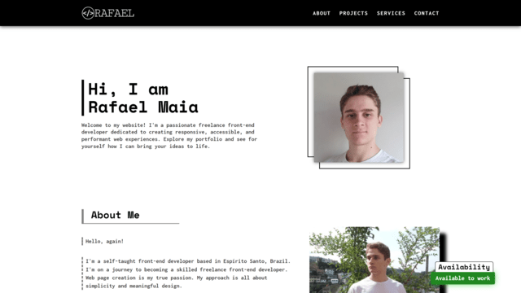

# My Portfolio

## Table of Contents

- [Introduction](#introduction)
- [Overview](#overview)
  - [Screenshot](#screenshot)
  - [Links](#links)
- [Process](#process)
  - [Built with](#built-with)
  - [Highlights](#highlights)
  - [Useful Resources](#useful-resources)
- [Owner](#owner)
- [License](#license)

## Introduction

Welcome to my portfolio's repository. Here you can see all the code written for the page.

My portfolio is a single page application built primarily with React. It showcases all of my projects, services, some personal information and contact information.

I made sure the portfolio is accessible following best practices. I used proper markup. I made it operable, understandable, perceivable and robust.

Please, feel free to contact me and give feedback on how to improve my portfolio. I'll be happy to talk to you!

## Overview

### Screenshot



### Links

- [Live Site](https://rafaeldevvv.github.io/portfolio)

## Process

### Built with

- HTML
- CSS
- SASS/SCSS
- JavaScript
- React.js
- Git/GitHub
- Font Awesome
- Webpack
- Babel
- JSX

### Highlights

I used context to make the data about the author(me) available to all components.

```jsx
import React from "react";
import Header from "./components/Header.jsx";
import Main from "./components/Main.jsx";
import Footer from "./components/Footer.jsx";
import { AuthorContext } from "./AuthorContext.js";

export default function App({ author }) {
  return (
    <React.StrictMode>
      <AuthorContext.Provider value={author}>
        <Header />
        <Main />
        <Footer />
      </AuthorContext.Provider>
    </React.StrictMode>
  );
}
```

When the "Show more projects" button is clicked, the first new project is focused and the page is scrolled to the last new project.

```jsx
export function ProjectList({ projects }) {
  const initialNumberOfProjects = 6;
  const [numberOfProjectsShown, setNumberOfProjectsShown] = useState(
    initialNumberOfProjects
  );
  const projectRefs = useRef(null); // these are the list items

  function getMap() {
    if (!projectRefs.current) {
      projectRefs.current = new Map();
    }

    return projectRefs.current;
  }

  function handleShowClick() {
    const scrollOptions = { block: "center", behavior: "smooth" };

    if (numberOfProjectsShown < projects.length) {
      const nextNumberOfProjectsShown = Math.min(
        numberOfProjectsShown + 3,
        projects.length
      );

      // update dom immediately
      flushSync(() => {
        setNumberOfProjectsShown(nextNumberOfProjectsShown);
      });

      // a ref has the last values regardless of the which render the handler is being run in
      const updatedMap = getMap();
      const projectNames = Array.from(updatedMap.keys());

      // get the first new project and focus it
      const firstNewProjectName = projectNames[numberOfProjectsShown];
      const firstNewProject = updatedMap.get(firstNewProjectName);
      firstNewProject.focus();

      // get last project in the dom
      const lastProjectName = projectNames[nextNumberOfProjectsShown - 1];
      const lastProject = updatedMap.get(lastProjectName);

      // get the last image and then wait for it to load to scroll it into view
      const lastProjectImage = lastProject.querySelector(".project-image");

      lastProjectImage.onload = function () {
        lastProject.scrollIntoView(scrollOptions);
      };
    } else {
      flushSync(() => {
        setNumberOfProjectsShown(initialNumberOfProjects);
      });
      const map = getMap();
      const firstProjectName = Array.from(map.keys())[0];
      const firstProject = map.get(firstProjectName);

      firstProject.scrollIntoView(scrollOptions);
      firstProject.focus();
    }
  }

  const allProjectsAreShown = numberOfProjectsShown === projects.length;
  const buttonMessage = allProjectsAreShown
    ? `Show less projects`
    : "Show more projects";

  return (
    <div>
      <ul
        id="projects-list"
        aria-live="polite"
        aria-relevant="additions removals"
      >
        {projects.map((p, i) => {
          if (i < numberOfProjectsShown) {
            return (
              <li
                key={p.name}
                ref={(node) => {
                  const map = getMap();

                  if (node) map.set(p.name, node);
                  else map.delete(p.name);
                }}
                tabIndex="-1"
                className="no-focus-ring"
              >
                <Project project={p} />
              </li>
            );
          }
        })}
      </ul>
      <div className="show-button-container">
        <button type="button" onClick={handleShowClick}>
          <span className="button-label">{buttonMessage}</span>
          <i
            className={`fa-solid fa-chevron-${
              allProjectsAreShown ? "up" : "down"
            } icon`}
            aria-hidden="true"
          ></i>
        </button>
      </div>
    </div>
  );
}
```

Useful properties for scrolling:

```scss
html {
  scroll-padding-top: 5rem;
  scroll-behavior: smooth;

  @media (prefers-reduced-motion: reduce) {
    scroll-behavior: auto;
  }
}
```

I had to use `encodeURIComponent()` and manually change the url of the browser because the default behavior caused spaces to be replaced with plus signs.

```jsx
function EmailForm() {
  const [subject, setSubject] = useState("");
  const [body, setBody] = useState("");

  const author = useAuthor();

  return (
    <form
      id="email-form"
      onSubmit={(e) => {
        e.preventDefault();
        const encodedBody = encodeURIComponent(body);
        const encodedSubject = encodeURIComponent(subject);

        //  window.open(`mailto:${author.email}?body=${encodedBody}&subject=${encodedSubject}`);
        location.href = `mailto:${author.email}?body=${encodedBody}&subject=${encodedSubject}`;
      }}
    >
      <p>
        <label htmlFor="inSubject">Subject</label>
        <input
          name="subject"
          id="inSubject"
          value={subject}
          onChange={(e) => setSubject(e.target.value)}
          placeholder="e.g. Landing Page"
        />
      </p>

      <p>
        <label htmlFor="inBody">Body</label>
        <textarea
          name="body"
          id="inBody"
          value={body}
          onChange={(e) => setBody(e.target.value)}
        />
      </p>

      <button type="submit">
        <span className="text">Send email</span>
        <span className="icon">
          <i className="fa-regular fa-paper-plane"></i>
        </span>
      </button>
    </form>
  );
}

```

### Useful Resources

- [How I made my portfolio](https://tekolio.com/how-i-made-my-portfolio-in-react/#:~:text=Making%20a%20portfolio%20in%20HTML,we%20have%20as%20React%20developers.)
- [StackOverflow - How to get the user language](https://stackoverflow.com/questions/8199760/how-to-get-the-browser-language-using-javascript)
- [HTML to JSX](https://transform.tools/html-to-jsx)
- [ChatGPT](https://chat.openai.com/)
- [Image Compressor](https://imagecompressor.com/)
- [Image Resizer](https://imageresizer.com/) - This was very useful as my computer does not have sufficient computing resources to keep photoshop and vs code open at the same time.
- [HTML element reference](https://developer.mozilla.org/en-US/docs/Web/HTML/Element) - A huge list of html elements.
- [date-fns package](https://www.npmjs.com/package/date-fns)
- [Stack Overflow - How do i add html form data to a mailto link](https://stackoverflow.com/questions/52637406/how-do-i-add-html-form-data-to-a-mailto-link) - This helped me figure out how to send emails without spaces being replaced with plus signs.
- [Stack Overflow - Whatsapp API related question](https://stackoverflow.com/questions/30344476/web-link-to-specific-whatsapp-contact) - How to send messages via whatsapp from my website.
- [Possible Heading](https://equalizedigital.com/accessibility-checker/possible-heading/)
- [Favicon not showing - Stack Overflow](https://stackoverflow.com/questions/11797094/favicon-not-showing)
- [Tips for designing focus indicators](https://www.deque.com/blog/give-site-focus-tips-designing-usable-focus-indicators/)
- [WebAIM - Contrast Checker](https://webaim.org/resources/contrastchecker/)
- [MDN AI Help](https://developer.mozilla.org/en-US/plus/ai-help)
- [Pexels](https://www.pexels.com/)
- [Stack Overflow - Open Graph og:image not pulling images](https://stackoverflow.com/questions/8855361/fb-opengraph-ogimage-not-pulling-images-possibly-https)
- [Open Graph Data checker](https://www.opengraph.xyz/)
- [scroll-behavior](https://developer.mozilla.org/en-US/docs/Web/CSS/scroll-behavior)
- [smooth scrolling and accessibility](https://css-tricks.com/smooth-scrolling-accessibility/)
- [How do I modify the URL without reloading the page?](https://stackoverflow.com/questions/824349/how-do-i-modify-the-url-without-reloading-the-page)
- [Working with the History API](https://developer.mozilla.org/en-US/docs/Web/API/History_API/Working_with_the_History_API)
- [Stop Using Fixed Headers and Start Using Sticky Ones](https://dev.to/luisaugusto/stop-using-fixed-headers-and-start-using-sticky-ones-1k30)
- [One line CSS solution to prevent anchor links from scrolling behind a sticky or fixed header](https://getpublii.com/blog/one-line-css-solution-to-prevent-anchor-links-from-scrolling-behind-a-sticky-header.html)
- [How to focus an element without triggering screen reader](https://stackoverflow.com/questions/68567802/how-to-focus-an-element-without-triggering-screen-reader)

## Owner

- Instagram - [@rafaeldevvv](https://www.instagram.com/rafaeldevvv)
- Twitter - [@rafaeldevvv](https://www.twitter.com/rafaeldevvv)
- Email: rafaeldeveloperr@gmail.com

## License

MIT License

Copyright (c) 2023 Rafael Maia

Permission is hereby granted, free of charge, to any person obtaining a copy
of this software and associated documentation files (the "Software"), to deal
in the Software without restriction, including without limitation the rights
to use, copy, modify, merge, publish, distribute, sublicense, and/or sell
copies of the Software, and to permit persons to whom the Software is
furnished to do so, subject to the following conditions:

The above copyright notice and this permission notice shall be included in all
copies or substantial portions of the Software.

THE SOFTWARE IS PROVIDED "AS IS", WITHOUT WARRANTY OF ANY KIND, EXPRESS OR
IMPLIED, INCLUDING BUT NOT LIMITED TO THE WARRANTIES OF MERCHANTABILITY,
FITNESS FOR A PARTICULAR PURPOSE AND NONINFRINGEMENT. IN NO EVENT SHALL THE
AUTHORS OR COPYRIGHT HOLDERS BE LIABLE FOR ANY CLAIM, DAMAGES OR OTHER
LIABILITY, WHETHER IN AN ACTION OF CONTRACT, TORT OR OTHERWISE, ARISING FROM,
OUT OF OR IN CONNECTION WITH THE SOFTWARE OR THE USE OR OTHER DEALINGS IN THE
SOFTWARE.

**Note**: Contact me via email rafaeldeveloperr@gmail.com for discussing usage permissions
